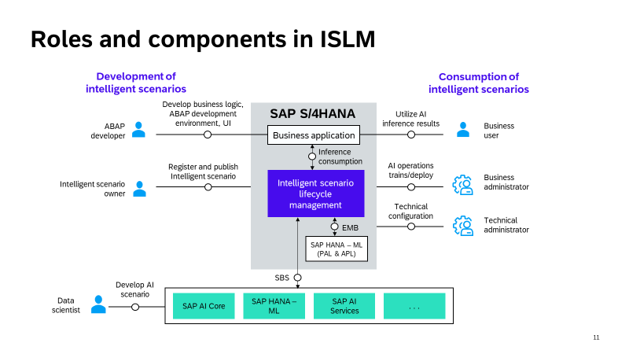

# AI267 - Empower AI Embedding into SAP S/4HANA with ISLM 

## Description

This repository contains the material for the SAP TechEd 2023 session called AI267 - Empower AI Embedding into SAP S/4HANA with ISLM.

ISLM standardizes the integration and consumption of intelligent scenarios within SAP S/4HANA for both embedded as well as side-by-side scenarios.

ISLM can be leveraged to perform lifecycle operations, including (scheduled) (re-)training and deployment as well as activation of the model that should be consumed by the business application, directly within SAP S/4HANA. ML ops in ISLM is supported in the context of ML use case(Intelligent Scenario). 

## Overview

In the rapidly evolving landscape of AI and machine learning, Intelligent Scenario Lifecycle Management (ISLM) has emerged as a critical framework that bridges the gap between data science endeavors and practical application development. ISLM plays a pivotal role in streamlining and optimizing the adoption of AI solutions, particularly within the SAP S/4HANA environment.

This technical workshop will provide a deep dive into ISLM, focusing on its role as a catalyst for efficient AI content development and integration within SAP S/4HANA. The scope of this workshop includes:
1)	**Introduction to ISLM**: Understanding the fundamentals of ISLM and its significance in the AI ecosystem.
2)	**ISLM Integration**: Learning how ISLM standardizes the integration of intelligent scenarios within SAP S/4HANA.
3)	**Embedding AI into applications**: Understanding how application developers leverage ISLM for creating, registering, publishing, and managing scenarios.
4)	**Lifecycle Streamlining**: Discovering how ISLM simplifies and streamlines essential lifecycle operations, including training and deployment, to enhance efficiency.

By the end of this workshop, participants will gain a comprehensive understanding of how ISLM empowers organizations to smoothly transition from data science experimentation to real-world AI application development, all within the SAP S/4HANA environment.

**Note**: Data science and AI Content development is out of the scope of this session. In this workshop, we will explore ML lifecycle management process. 

## Requirements

The requirements to follow the exercises in this repository are...

## Use Cases

In this workshop, our focus will be on a real-world use case example where a leading airline is looking to enhance its customer experience using AI-driven predictive technology. Data scientists are tasked with developing and testing machine learning models. After the data science phase, the challenge lies in seamlessly transitioning these models into production within the SAP S/4HANA landscape. This is where ISLM comes into play, offering a unified framework to simplify integration, streamline deployment, and manage the lifecycle of these intelligent scenarios.

1)	**Predict the airplane seats that are being occupied in the first class of a flight**  
   In this specific use case, our goal is to forecast the occupancy of first-class seats on flights by harnessing the power of SAP HANA's Machine Learning (ML) algorithm. This predictive capability holds great potential for airlines, as it streamlines aircraft selection and improves the allocation of first-class seats, thus enhancing the overall passenger experience. This approach is often referred to as 'embedded ML,' where the ML provider and the business application exist within the same stack.
   
2)	**Predict the plane type of an aircraft**  
   This use case involves predicting the aircraft type using the SAP BTP-based reusable SAP AI Business Service, Data Attribute Recommendation Service (DAR), powered by an ML algorithm. This predictive capability enhances aircraft selection for different flight scenarios. This approach is commonly known as 'side-by-side,' where the ML provider and the business application operate within separate stacks.

    

## Exercises

Provide the exercise content here directly in README.md using [markdown](https://guides.github.com/features/mastering-markdown/) and linking to the specific exercise pages, below is an example.

- [Exercise 1 - Predict the airplane seats that are being occupied in the first class of a flight](exercises/ex0/)
- [Exercise 2 - Predict the plane type of an aircraft](exercises/ex1/)
- [Summary](exercises/ex2/)

## Additional Exercises
The following exercise is Advanced exercise where the Model Training can be scheduled automatically.
However, you can perform this exercise already after Exercise 1.

  
## Contributing
Please read the [CONTRIBUTING.md](./CONTRIBUTING.md) to understand the contribution guidelines.

## Code of Conduct
Please read the [SAP Open Source Code of Conduct](https://github.com/SAP-samples/.github/blob/main/CODE_OF_CONDUCT.md).

## How to obtain support

Support for the content in this repository is available during the actual time of the online session for which this content has been designed. Otherwise, you may request support via the [Issues](../../issues) tab.

## License
Copyright (c) 2023 SAP SE or an SAP affiliate company. All rights reserved. This project is licensed under the Apache Software License, version 2.0 except as noted otherwise in the [LICENSE](LICENSES/Apache-2.0.txt) file.
